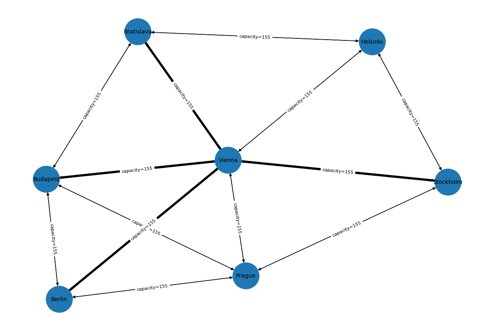
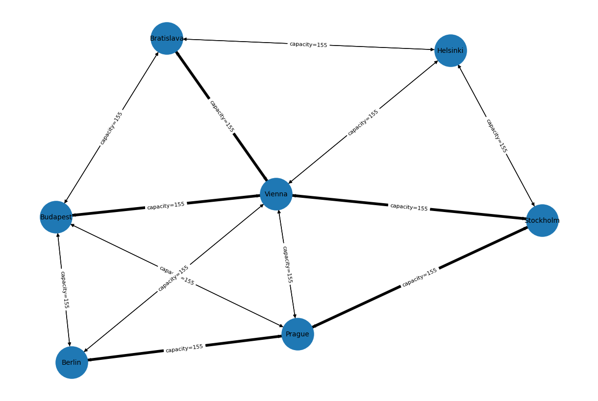
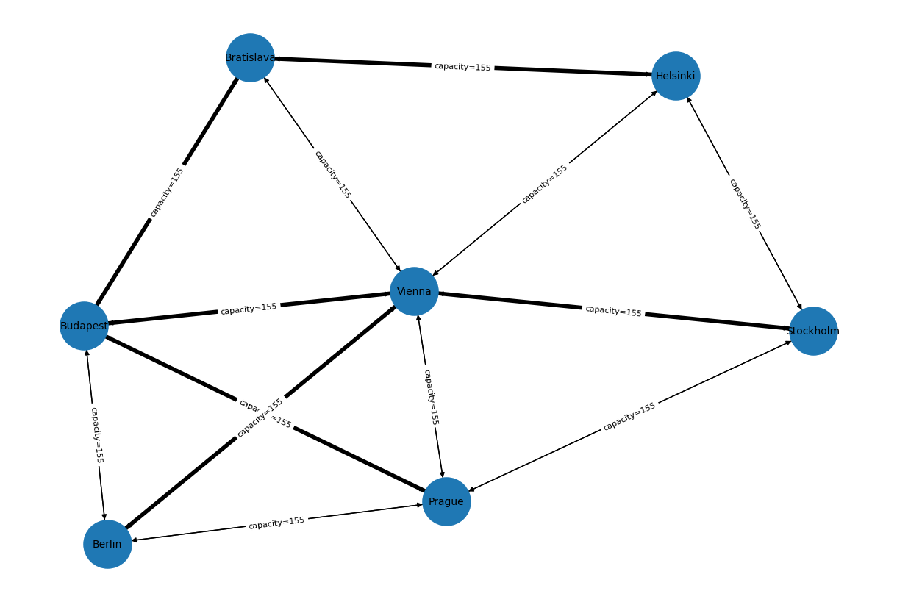

# SDN ILP Flow Routing

This repository implements flow-based routing for Software-Defined Networks (SDN). The routing problem is formulated as a mixed-integer linear program (MILP) that minimizes the number of active network links while satisfying QoS bandwidth requirements and TCAM rule capacity constraints. This reflects the cost, energy, and scalability limitations of TCAM-based forwarding hardware in SDN switches.

## Problem formulation

### Network model

- Network topology: directed graph $G=(V,L)$
  - $V$ — set of switches (nodes)
  - $L$ — set of directed links $(u,v)$
- Flows: $F$
  - each flow $f \in F$ has:
    - source $s_f \in V$
    - destination $t_f \in V$
    - bandwidth demand $b_f > 0$
- Link capacity: $C_{u,v}$ for each $(u,v)\in L$
- TCAM rule capacity per switch: $R^{max}_v$ for each $v \in V$

Flows are unsplittable, which means that each flow is routed along a single path from $s_f$ to $t_f$.

### Decision variables

- **Flow routing**
  - $\alpha^f_{u,v} \in \{0,1\}$
  - $\alpha^f_{u,v} = 1$ if flow $f$ uses link $(u,v)$

- **Active link indicator**
  - $x_{u,v} \in \{0,1\}$
  - $\alpha^f_{u,v} \le x_{u,v}$ (if any flow $f$ goes through $(u,v)$ link, then the link is active)

- **Rule utilization per switch**
  - $R^{util}\_v = \sum_{f\in F}\sum_{w\in succ(v)} \alpha^{f}_{v,w}$

- **Link utilization**
  - $C^{util}\_{u,v} = \sum_{f\in F} \alpha^{f}_{u,v} b_f$

### Objective function

The optimization objective is implemented using a Big-M formulation.

- **Primary objective**: minimize the number of active links  
  - $\min \sum_{(u,v)\in L} x_{u,v}$

- **Secondary objective**: minimize routing cost including path length, relative TCAM and link utilization

- **Final objective**:
  - $\min M \sum_{(u,v)\in L} x_{u,v} + \sum_{f\in F}\sum_{(u,v)\in L} \left(\alpha^f_{u,v} + w^f_{u,v} + z^f_{u,v}\right)$
  - where:
    - $M \gg 1$ (enforces priority of active link minimization)
    - $w^f_{u,v} = r_{max} \alpha^f_{u,v}$
    - $z^f_{u,v} = y_{u,v} \alpha^f_{u,v}$
    - $r_{max} = \max_{v\in V}\left(\frac{R^{util}_v}{R^{max}_v}\right)$ (maximum relative TCAM utilization)
    - $y_{u,v} = \left(\frac{C^{util}_e}{C_e}\right)$ (relative link utilization)

### Constraints

- **Flow conservation**: for each flow $f$ and node $v$:
    - $\sum_{(v,w)\in L} \alpha^f_{v,w} - \sum_{(u,v)\in L} \alpha^f_{u,v} = m$
       - $m=1$ if $v=s_f$
       - $m=-1$ if $v=t_f$
       - $m=0$ otherwise

- **Link capacity**
  - $\sum_{f\in F}\alpha^f_{u,v}\,b_f \le C_{u,v}$

- **TCAM rule capacity**
  - $R^{util}_v \le R^{max}_v$

## Usage
1. Clone this repo
```bash
git clone https://github.com/justkow/sdn-ilp-flow-routing.git
cd sdn-ilp-flow-routing
```

2. Install dependencies
```bash
pip install -r requirements.txt
```

3. Then run
```bash
python3 main.py
```

## Results

#### Scenario 1: Minimizing active network links
All flows are routed through Vienna
```text
[INFO]: Paths for each demand:
	1: ['Stockholm', 'Vienna', 'Bratislava']
	2: ['Stockholm', 'Vienna', 'Budapest']
	3: ['Stockholm', 'Vienna', 'Berlin']
[INFO]: Active links:
	('Vienna', 'Berlin')
	('Vienna', 'Bratislava')
	('Vienna', 'Budapest')
	('Stockholm', 'Vienna')
```


#### Scenario 2: Ensure link capacity for each flow
1st and 2nd flows consume most of the Stockholm–Vienna link capacity. Therefore, the 3rd flow must be routed to Berlin via Prague.
```text
[INFO]: Paths for each demand:
	1: ['Stockholm', 'Vienna', 'Bratislava']
	2: ['Stockholm', 'Vienna', 'Budapest']
	3: ['Stockholm', 'Prague', 'Berlin']
[INFO]: Active links:
	('Vienna', 'Bratislava')
	('Vienna', 'Budapest')
	('Stockholm', 'Vienna')
	('Prague', 'Berlin')
	('Stockholm', 'Prague')
```


#### Scenario 3: Limiting the maximum number of flow table entries to 3 per switch
Not all flows can be routed via the shortest path through Vienna. One of the flows must take an alternative path due to entry constraints.
```text
[INFO]: Paths for each demand:
	1: ['Stockholm', 'Vienna', 'Budapest', 'Bratislava']
	2: ['Stockholm', 'Vienna', 'Budapest']
	3: ['Stockholm', 'Vienna', 'Berlin']
	4: ['Prague', 'Budapest', 'Bratislava', 'Helsinki']
[INFO]: Active links:
	('Prague', 'Budapest')
	('Vienna', 'Budapest')
	('Stockholm', 'Vienna')
	('Budapest', 'Bratislava')
	('Vienna', 'Berlin')
	('Bratislava', 'Helsinki')
```


## Credits
The implemented model is based on the approach proposed in the article:
- Priyanka Kamboj, Sujata Pal “QoS-Aware Flow Routing with Minimizing Active Links and Rule Capacity Constraints in SDN Networks”
